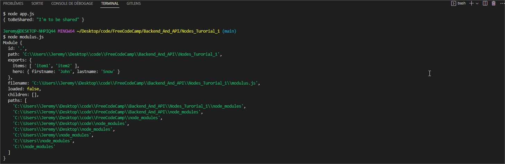

# Node.js & Express.js

## NodeJS
- [Node.js \& Express.js](#nodejs--expressjs)
  - [NodeJS](#nodejs)
    - [Globals](#globals)
    - [Modules](#modules)
    - [Built in Modules](#built-in-modules)
      - [Operating System Module (OS)](#operating-system-module-os)
      - [Path Module](#path-module)
      - [FileSystem SYNC](#filesystem-sync)
      - [FileSystem ASYNC](#filesystem-async)
      - [ASYNC vs SYNC](#async-vs-sync)
      - [ASYNC AWAIT \& Promises](#async-await--promises)

NodeJS is an environment to run JavaSCript outside of a browser.

### Globals

__dirname - path to the current directory

__filename - current file name

require - function to use modules (CommonJS)

module - Info about current module (file)

process - Info about env where the program is being executed

### Modules

Global **module** variable contains information about the corresponding file, it is a JSON object.

```js
Module {
  id: '.',
  path: 'C:\\Users\\Jeremy\\Desktop\\code\\FreeCodeCamp\\Backend_And_API\\Nodes_Turorial_1',
  exports: {},
  filename: 'C:\\Users\\Jeremy\\Desktop\\code\\FreeCodeCamp\\Backend_And_API\\Nodes_Turorial_1\\app.js',
  loaded: false,
  children: [],
  paths: [
    'C:\\Users\\Jeremy\\Desktop\\code\\FreeCodeCamp\\Backend_And_API\\Nodes_Turorial_1\\node_modules',
    'C:\\Users\\Jeremy\\Desktop\\code\\FreeCodeCamp\\Backend_And_API\\node_modules',
    'C:\\Users\\Jeremy\\Desktop\\code\\FreeCodeCamp\\node_modules',
    'C:\\Users\\Jeremy\\Desktop\\code\\node_modules',
    'C:\\Users\\Jeremy\\Desktop\\node_modules',
    'C:\\Users\\Jeremy\\node_modules',
    'C:\\Users\\node_modules',
    'C:\\node_modules'
  ]
}
```
module variable contains a exports object that one can set as needed. Let's say we have a modulus.js file containing a variable we want to share with the app.js file.

In the modulus.js we can set the exports property as follow

```js
    // modulus.js file
    const toBeShared = "I'm to be shared"
    module.exports = {toBeShared}
```

Then we can acces this variable from the app.js with :

```js
    // app.js file
    const toBeShared = require('./modulus.js')
    console.log(toBeShared)
```

Our module is now accessible as an object

```js 
{ toBeShared: "I'm to be shared" }
```
Other flavour of exports :

```js
// Still in modilus.js file

module.exports.items = ['item1', 'item2']
const person = {
    firstname: "John",
    lastname: "Snow",
}
module.exports.hero = person
```


### Built in Modules

#### Operating System Module (OS)

OS is a built in module that contains informations about the operating system.

```js
const os = require('os');

// Current User inf
const user = os.userInfo();
console.log(user);

```

```sh
$ node app.js 
{
  uid: -1,
  gid: -1,
  username: 'Jeremy',
  homedir: 'C:\\Users\\Jeremy',
  shell: null
}

```
Other OS utilities

```js

// Returns the system uptime in seconds
console.log(`The system uptime is ${os.uptime()} seconds`);

const currentOS = {
    name: os.type(),
    release: os.release(),
    totalMem: os.totalmem(),
    freeMem: os.freemem(),
}
console.log(currentOS);
```
```sh 
The system uptime is 133809 seconds
{
  name: 'Windows_NT',
  release: '10.0.19044',
  totalMem: 16953638912,
  freeMem: 6310240256
}

```

#### Path Module

```js
const path = require('path')

// Get the local system path separator
console.log("My system path separator is : " + path.sep);

// Join is usefull to create pathes that will work on all systems
const pathfile = path.join('./folder', 'subfolder', 'test.txt')
console.log(`Here is my path ${pathfile}`);

// Will also make all parts of the path accessible with methods
const base = path.basename(pathfile);
console.log(`Here is my file basename ${base}`);

const absolute = path.resolve(__dirname, 'folder', 'subfolder', 'test.txt')
console.log(`Absolute path is  ${absolute}`);


```

```
$ node app.js 
My system path separator is : \
Here is my path folder\subfolder\test.txt
Here is my file basename test.txt
Absolute path is  C:\Users\Jeremy\Desktop\code\FreeCodeCamp\Backend_And_API\Nodes_Turorial_1\folder\subfolder\test.txt


```

#### FileSystem SYNC

```js
const {readFileSync, writeFileSync} = require('fs')

// Read from file
const firstFile = readFileSync('./content/first.txt', 'utf8');
const secondFile = readFileSync('./content/second.txt', 'utf8');

console.log(firstFile, secondFile);

// Write in a file, created if not exists, overwritten if exists
writeFileSync(
    './content/result-syn.txt',
      `Here is the result : ${firstFile}, ${secondFile}`
);

// Append

writeFileSync(
    './content/result-syn.txt',
      `Here is the result : ${firstFile}, ${secondFile}`,
      {flag: 'a'}
);

```

#### FileSystem ASYNC

```js

  // CallBack Hell

  const {readFile, writeFile} = require('fs')

readFile('./content/first.txt', 'utf8', (err, result) => {
  if(err){
    console.log(err)
    return
  }
  const first = result;
  readFile('./content/second.txt', 'utf8', (err, result) => {
    if(err){
      console.log(err)
      return 
    }
    const second = result;
    writeFile(
      './content/result-asyn.txt',
       `File 1 was :  ${first}, File 2 was :  ${second}`,
       (err, result) => {
          if(err){
            console.log(err)
            return 
          }
      console.log(result);
    })
  })
})
```

#### ASYNC vs SYNC

In a SYNC approach, JS will start with a task only when previous one is done, going along line after line, this is a problem. When multiple users make requests to the same app, this will make the app crash.

ASYNC will act differently, when in a callback, it will process what is in it in a separated threads and will continue to execute the code after the callback even if the alternative process is not finished.

#### ASYNC AWAIT & Promises 

//TODO Check async await and promise tuto and take notes


Asynchronous opens a parralel threads to the main synchronous one.

      _______   
____/________\________>

Call back is when we call a function as an argument of another function.